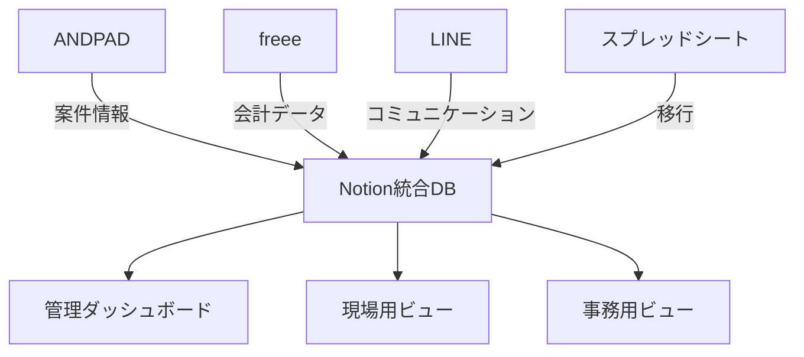

# AGOグループ Notion設計提案書
## ANDPADとの連携を踏まえた統合業務管理システム

最終更新日：2025年1月20日

---

## 📌 エグゼクティブサマリー

本提案書は、AGOグループの業務効率化を目的として、既存のANDPADシステムとNotionを連携させた統合業務管理システムの設計を提示します。ANDPADの案件管理機能を基軸に、Notionの柔軟なデータベース機能を活用することで、経費管理・人材管理・ナレッジ共有を一元化し、業務効率の大幅な改善を実現します。

### 期待効果
- 経費処理時間：**50%削減**
- 情報検索時間：**70%削減**
- 案件収支の可視化：**リアルタイム化**
- 業務の属人化：**80%解消**

---

## 🏗️ システム全体構成

### 1. 既存システムとの関係性



### 2. データ連携の基本方針
- **ANDPAD**：案件マスターデータの源泉
- **Notion**：統合管理・分析・ナレッジ蓄積
- **freee**：正式な会計記録
- **LINE**：日常コミュニケーション（記録はNotionへ）

---

## 📊 Notionデータベース設計

### 1. マスターデータベース構造

#### 🏢 案件データベース（Projects）
```
主要フィールド：
- 案件ID（ANDPAD連携）
- 案件名
- クライアント（リレーション）
- ステータス（準備中/進行中/完了/請求済/入金済）
- 責任者（大沢・磯ヶ谷・金子から選択）
- 担当職人（複数選択）
- 開始日・完了予定日

【収益管理フィールド】
- 契約金額（売上高）
- 原価内訳：
  - 材料費（実績）
  - 外注費（実績）
  - 労務費（実績）
  - その他経費（実績）
  - 発注者不明経費（AGO特有）
- 原価合計（自動計算）
- 粗利益（自動計算：契約金額 - 原価合計）
- 粗利益率（自動計算：粗利益 ÷ 契約金額 × 100）
- 利益率ステータス（30%以上:優良、20-30%:標準、20%未満:要改善）

【管理フィールド】
- 追加工事フラグ（仕様変更対応）
- 菅野社長直接発注分（別枠管理）
- 現金支出分（レシート連携）
- 関連ドキュメント
- 進捗率（自動計算）
- ボーナス配分率（責任者用・職人用）
```

#### 👥 クライアントデータベース（Clients）
```
主要フィールド：
- クライアントID
- 会社名・店舗名
- 担当者情報
- 連絡先（電話・メール・LINE）
- 取引履歴（案件リレーション）
- 累計売上（自動集計）
- 重要度ランク
- 備考・注意事項
```

#### 💰 経費データベース（Expenses）
```
主要フィールド：
- 経費ID
- 発生日・支払日
- 案件（リレーション）
- 原価カテゴリー（材料費/外注費/労務費/その他経費）
- 詳細分類（シート/ターポリン/アルポリ/電材/清掃等）
- 金額
- 業者名
- 発注者（明確化）
- 支払方法
- 領収書（ファイル添付）
- 承認ステータス
- freee連携フラグ
- ホワイトボード引き出し番号（物理連携）
```

#### 👷 人員データベース（Staff）
```
主要フィールド：
- スタッフID
- 氏名・役職
- 責任者フラグ（大沢・磯ヶ谷・金子）
- スキルセット（タグ）
- 稼働状況
- 担当案件（リレーション）
- 月次稼働率

【業績管理フィールド】
- 累計粗利益貢献額（ロールアップ）
- 平均粗利益率
- 担当案件数
- 評価ポイント（20ポイント制）
- 基本歩合率（役職別）
- 緊急連絡先
```

#### 📋 タスクデータベース（Tasks）
```
主要フィールド：
- タスクID
- タスク名
- 案件（リレーション）
- 担当者
- 期限
- 優先度
- ステータス
- 作業時間（予定/実績）
- 完了報告（画像添付可）
```

#### 📚 ナレッジデータベース（Knowledge）
```
主要フィールド：
- ドキュメントID
- タイトル
- カテゴリー（マニュアル/事例/トラブル対応）
- タグ（複数）
- 本文（リッチテキスト）
- 添付ファイル
- 更新履歴
- 閲覧権限
```

#### 💎 チームボーナス計算データベース（TeamBonus）【新規追加】
```
主要フィールド：
- 計算ID
- チーム名（大沢チーム/磯ヶ谷チーム/金子チーム）
- 責任者（リレーション：人員DB）
- チームメンバー（リレーション：人員DB、複数）
- 対象期間（月次/四半期）
- 担当案件リスト（リレーション：案件DB）
- チーム粗利益合計（ロールアップ集計）
- 20項目評価点（0-20点）
- チームボーナス総額（自動計算）
- 分配方法（均等/貢献度別/カスタム）
- 承認ステータス（未承認/承認済/支払済）
- 備考（特記事項）
```

#### 🎯 20項目評価データベース（EvaluationCriteria）【新規追加】
```
主要フィールド：
- 評価ID
- チーム（リレーション：チームボーナスDB）
- 評価期間
- 基礎スキル評価：
  - 図面指示読み可能（0/1）
  - 発注管理（0/1）
  - ほうれんそう（0/1）
  - 材料・工具準備（0/1）
- 応用スキル評価：
  - 指示なし施工（0/1）
  - 顧客対応（0/1）
  - 緊急事態対応（0/1）
  - 在庫管理（0/1）
  - 単独施工（0/1）
- マネジメント評価：
  - 施工指示（0/1）
  - 現場管理（0/1）
  - 案件管理（0/1）
  - 営業管理（0/1）
- 合計点（自動計算：0-20点）
```

### 2. リレーション設計

```
案件DB ←→ クライアントDB（多対一）
案件DB ←→ 経費DB（一対多）
案件DB ←→ タスクDB（一対多）
案件DB ←→ 人員DB（多対多）
案件DB ←→ チームボーナスDB（多対多）
タスクDB ←→ 人員DB（多対一）
人員DB ←→ チームボーナスDB（多対多）
チームボーナスDB ←→ 20項目評価DB（一対多）
```

---

## 🖥️ ビュー設計（役割別）

### 1. 経営者ダッシュボード（菅野社長用）

#### 📊 KPIダッシュボード
- **月次売上・粗利益グラフ**
- **案件別粗利益一覧**
  - 粗利益額でソート（降順）
  - 粗利益率で色分け（30%以上:緑、20-30%:黄、20%未満:赤）
  - 責任者フィルター機能
- **責任者別パフォーマンス**
  - チーム別パフォーマンス
  - 月次チーム粗利益合計
  - 平均粗利益率
  - 担当案件数
  - 20項目評価点
  - 推奨チームボーナス額（自動計算）
- **キャッシュフロー予測**

#### 🎯 アクション必要項目
- **承認待ち案件**（50万円以上）
- **粗利益率警告**（20%未満の案件を赤色表示）
- **未回収債権リスト**
- **ボーナス承認待ち**（月末処理）
- **人員配置最適化提案**

### 2. 現場責任者ビュー（大沢・磯ヶ谷・金子用）

#### 💰 チーム収益管理ボード
- **チーム全体の収益状況**
  - チーム合計：売上・原価・粗利益
  - 案件別収支一覧
  - 原価超過アラート
  - 改善ポイントの提示
- **20項目評価状況**
  - 現在の達成点数（○/20点）
  - 未達成項目の一覧
  - 次回評価までの改善目標
- **チームボーナス予測**
  - 今月の予想チームボーナス総額
  - メンバーごとの分配予想
- **手当状況**
  - 番頭手当（現場管理できる人材育成時）
  - 主任手当（3組以上管理時）

#### 📅 工程管理ボード
- **本日の作業一覧**（カンバン形式）
- **週間スケジュール**（ガントチャート）
- **材料発注ステータス**
- **人員アサイン状況**

#### 📸 現場報告システム
- **写真アップロード**（ドラッグ&ドロップ）
- **完了報告フォーム**（定型化）
- **トラブル報告**（緊急度別）

### 3. 事務スタッフビュー（四ノ宮・小林・菅野友貴用）

#### 💼 経費処理センター
- **未処理経費一覧**（期限順）
- **承認ワークフロー**
- **freee連携ステータス**
- **月次締め処理チェックリスト**

#### 📋 発注管理
- **発注予定リスト**
- **業者別発注履歴**
- **在庫管理**（最小在庫アラート）

### 4. 職人ビュー（巻島・リチャード等）

#### 💵 チーム収益見える化ダッシュボード
```
今月のチーム成績（大沢チーム）：
━━━━━━━━━━━━━━━━━━━━━
【チーム全体】
  総売上: 450万円
  総原価: 315万円
  チーム粗利益: 135万円（30%）👍
  20項目評価: 16/20点

【担当案件内訳】
・ACQUA六本木店: 粗利益45万円（30%）👍
・個人宅内装: 粗利益12万円（15%）⚠️
・オフィス改装: 粗利益78万円（35%）🎆

【チームボーナス予測】
・チーム総額: 約13.5万円
・あなたの分配予想: 約3.4万円
  （チーム内でのあなたの貢献度：25%）

【原価削減のTips】
今月のポイント：材料のまとめ発注で単価5%削減！
━━━━━━━━━━━━━━━━━━━━━
```

#### 📱 日常作業画面
- **本日の作業内容**（大きな文字）
- **必要工具・材料リスト**
- **完了報告ボタン**（ワンタップ）
- **原価削減のコツ**（Tips表示）
- **緊急連絡先**

---

## 🔧 計算式と自動化設定

### 1. フォーミュラ（計算式）

#### 粗利益計算
```
粗利益 = prop("契約金額") - prop("材料費") - prop("外注費") - prop("労務費") - prop("その他経費") - prop("発注者不明経費")
```

#### 粗利益率計算
```
粗利益率 = if(prop("契約金額") > 0, 
            round(prop("粗利益") / prop("契約金額") * 100), 
            0)
```

#### チームボーナス総額計算
```
チームボーナス総額 = prop("チーム粗利益合計") * (prop("20項目評価点") / 20) * prop("ボーナス係数")
```

#### 個人分配額計算（例：均等分配の場合）
```
個人分配額 = prop("チームボーナス総額") / prop("チームメンバー数")
```

#### 個人分配額計算（例：貢献度別の場合）
```
個人分配額 = prop("チームボーナス総額") * prop("個人貢献度率")
```

### 2. 自動化ルール

#### 案件完了時
- トリガー：ステータスが「完了」に変更
- アクション：
  - 該当チームの粗利益合計を更新
  - チーム全体に粗利益結果を通知
  - 粗利益率20%未満の場合、チーム全体で改善策検討

#### 月末処理
- トリガー：毎月最終営業日
- アクション：
  - チーム別20項目評価の実施
  - チームボーナス総額の計算
  - 分配方法の確定（チーム内協議）
  - 経営レポートの作成

#### 原価超過アラート
- トリガー：原価が契約金額の80%を超過
- アクション：
  - 責任者と社長に即時通知
  - 原因分析フォームの自動生成

### 3. ビュー別表示制御

#### 条件付き表示
```
if(prop("粗利益率") >= 30, "🟢 優良", 
   if(prop("粗利益率") >= 20, "🟡 標準", 
      "🔴 要改善"))
```

---

## 🔄 ANDPAD連携方式

### 1. データ同期方法

#### 自動連携（推奨）
```
方式：API連携（開発必要）
頻度：リアルタイム
対象：案件基本情報、ステータス、写真
```

#### 半自動連携（現実的）
```
方式：CSV エクスポート/インポート
頻度：日次（始業時）
担当：事務スタッフ
所要時間：5分/日
```

#### 手動連携（導入初期）
```
方式：画面転記
対象：新規案件のみ
担当：案件登録者
```

### 2. 連携データマッピング

| ANDPAD項目 | Notion項目 | 備考 |
|------------|-----------|------|
| 案件名 | 案件名 | 完全一致必須 |
| 顧客名 | クライアント | リレーション |
| 工期 | 開始日・完了日 | 日付形式統一 |
| 担当者 | 担当者 | 複数選択可 |
| 写真 | 添付ファイル | 容量注意 |

---

## 💡 段階的導入計画

### Phase 1：基礎構築（1ヶ月目）

#### Week 1-2：データベース設計
- [ ] 基本DB作成（案件・経費・人員）
- [ ] テストデータ投入
- [ ] 権限設定

#### Week 3-4：パイロット運用
- [ ] 小規模案件で試験運用
- [ ] フィードバック収集
- [ ] 改善実施

### Phase 2：本格展開（2-3ヶ月目）

#### Month 2：全案件移行
- [ ] 既存データ移行
- [ ] スタッフ研修実施
- [ ] 運用ルール策定

#### Month 3：最適化
- [ ] ワークフロー改善
- [ ] 自動化推進
- [ ] KPI測定開始

### Phase 3：高度化（4-6ヶ月目）

#### 自動化推進
- [ ] 定型処理の自動化
- [ ] レポート自動生成
- [ ] アラート機能実装

#### AI活用
- [ ] データ分析・予測
- [ ] 最適化提案
- [ ] 異常検知

---

## 🎓 教育・研修計画

### 1. 役割別研修プログラム

#### 管理職向け（2時間）
- 粗利益ダッシュボード活用法
- ボーナス計算システムの理解
- 原価管理・改善手法
- データ分析手法

#### 事務スタッフ向け（4時間）
- データ入力手順
- ワークフロー理解
- トラブルシューティング

#### 現場スタッフ向け（1時間）
- 収益ダッシュボードの見方
- 原価削減のポイント
- モバイルアプリ操作
- 写真アップロード
- 報告手順

### 2. サポート体制

#### ヘルプデスク
- Slack/LINEでの即時対応
- FAQ・動画マニュアル
- 定期勉強会

#### チャンピオン制度
- 各部門に1名のエキスパート育成
- 横展開の推進役

---

## 💰 費用対効果分析

### 導入コスト

| 項目 | 金額 | 備考 |
|------|------|------|
| Notionライセンス | 月額2万円 | 20名分 |
| 初期構築 | 50万円 | 外注の場合 |
| 研修費用 | 10万円 | 資料作成含む |
| **合計** | **初年度92万円** | |

### 削減効果（年間）

| 項目 | 削減額 | 算出根拠 |
|------|---------|----------|
| 事務作業時間 | 240万円 | 2時間/日×時給2,000円×250日 |
| ミス削減 | 100万円 | 手戻り・修正コスト |
| 残業削減 | 180万円 | 月30時間×時給2,500円×20名 |
| 粗利益率改善 | 300万円 | 見える化による2%改善 |
| **合計** | **820万円** | |

### ROI（投資収益率）
- **初年度：792%**（820万-92万）/92万
- **2年目以降：3,317%**（820万-24万）/24万

---

## ⚠️ リスクと対策

### 1. 技術的リスク
- **データ消失**：定期バックアップ（日次）
- **アクセス障害**：オフライン対応手順
- **セキュリティ**：2段階認証必須

### 2. 組織的リスク
- **抵抗感**：段階導入で軽減
- **スキル不足**：継続的研修
- **属人化**：複数担当者育成

### 3. 運用リスク
- **ルール逸脱**：定期監査実施
- **データ不整合**：自動チェック機能
- **更新遅延**：リマインダー設定

---

## 💡 透明性がもたらす効果

### 1. 経営意識の醸成
- 職人が「単なる作業者」から「経営パートナー」へ意識変革
- コスト意識が自然に身につき、無駄な材料使用や手戻りの削減
- 自発的な改善提案の増加

### 2. チームワークの強化
- チーム全体の成果が個人の報酬に直結
- 相互扶助・教え合いの文化醸成
- 「チームで稼ぐ」意識の定着

### 3. モチベーション向上
- チームの成果が数字で見える化
- 20項目評価による明確な成長目標
- チームボーナスの公正な分配

### 4. 組織全体の収益力向上
- チーム間の健全な競争
- ベストプラクティスの横展開
- 赤字案件をチーム全体の学習機会として活用

### 5. 人材育成の加速
- 番頭・主任への昇格インセンティブ
- チーム内でのスキル伝承
- 「小さなAGO」を作る土壌形成

---

## 🎯 成功要因

### 1. 経営層のコミットメント
- 菅野社長の積極的活用
- 定期的な進捗確認
- 現場へのメッセージ発信

### 2. 段階的アプローチ
- スモールスタート
- 早期の成功体験
- 継続的改善

### 3. 現場目線の設計
- シンプルな操作性
- 明確なメリット提示
- フィードバック反映

---

## 📋 実装チェックリスト

### 準備フェーズ
- [ ] Notionワークスペース作成
- [ ] 基本データベース構築（案件・経費・人員・ボーナス計算）
- [ ] 粗利益計算フォーミュラ設定
- [ ] ANDPAD案件リスト出力
- [ ] 過去案件の原価データ整理
- [ ] 初期データ整備
- [ ] 権限設計・設定

### 構築フェーズ
- [ ] 収益管理ビュー作成（役割別）
- [ ] 粗利益率による色分け設定
- [ ] ボーナス自動計算設定
- [ ] ワークフロー設定
- [ ] テンプレート作成
- [ ] 自動化ルール設定（原価超過アラート等）
- [ ] モバイル最適化（職人向け収益ダッシュボード）

### 展開フェーズ
- [ ] パイロットユーザー選定
- [ ] 研修資料作成
- [ ] 初期研修実施
- [ ] 運用ルール文書化
- [ ] サポート体制確立

### 運用フェーズ
- [ ] 日次モニタリング
- [ ] 週次改善会議
- [ ] 月次効果測定
- [ ] 四半期レビュー
- [ ] 年次最適化

---

## 🚀 次のステップ

1. **承認取得**（1週間以内）
   - 本提案の承認
   - 予算確保
   - 推進体制決定

2. **詳細設計**（2週間）
   - 要件詳細化
   - 画面設計
   - データ移行計画

3. **プロトタイプ構築**（2週間）
   - 基本機能実装
   - デモ環境構築
   - 初期テスト

4. **本格導入開始**（1ヶ月後）

---

## 📞 お問い合わせ

本提案に関するご質問・ご相談は以下までお願いします：

- **技術面**：末武修平
- **業務面**：四ノ宮まゆ
- **戦略面**：菅野隆太社長

---

**AGOグループの更なる成長と効率化の実現に向けて、Notionを活用した統合業務管理システムの導入を強く推奨いたします。**