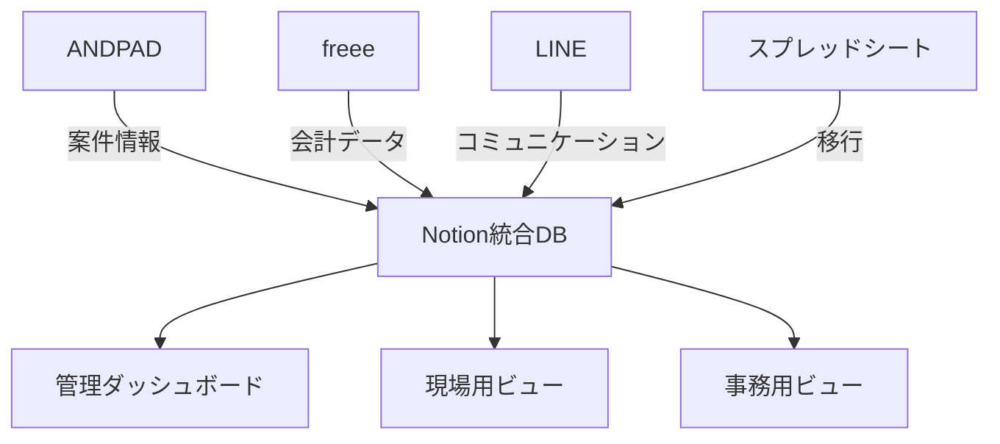

# AGOグループ Notion設計提案書
## ANDPADとの連携を踏まえた統合業務管理システム

最終更新日：2025年1月20日

---

## 📌 エグゼクティブサマリー

本提案書は、AGOグループの業務効率化を目的として、既存のANDPADシステムとNotionを連携させた統合業務管理システムの設計を提示します。ANDPADの案件管理機能を基軸に、Notionの柔軟なデータベース機能を活用することで、経費管理・人材管理・ナレッジ共有を一元化し、業務効率の大幅な改善を実現します。

### 期待効果
- 経費処理時間：**50%削減**
- 情報検索時間：**70%削減**
- 案件収支の可視化：**リアルタイム化**
- 業務の属人化：**80%解消**

---

## 🏗️ システム全体構成

### 1. 既存システムとの関係性



### 2. データ連携の基本方針
- **ANDPAD**：案件マスターデータの源泉
- **Notion**：統合管理・分析・ナレッジ蓄積
- **freee**：正式な会計記録
- **LINE**：日常コミュニケーション（記録はNotionへ）

---

## 👥 AGOグループメンバー表（発注管理特化版）

### メンバーデータベース構造

| 氏名 | 部門 | 役職 | 発注権限 | LINE名 | 主要業務 | 緊急連絡先 |
|------|------|------|----------|--------|----------|------------|
| 菅野隆太 | 経営 | 代表取締役 | 全権限 | 菅野隆太 | 経営・税務・直接発注 | 📞 ○○○-○○○○-○○○○ |
| 大澤怜司 | 施工 | 現場管理者・内装責任者 | あり | 大沢 | 内装・大工作業・現場管理・見積 | 📞 ○○○-○○○○-○○○○ |
| 礒ヶ谷洋平 | 施工 | 施工責任者 | あり | 磯ヶ谷 | 施工管理・品質管理 | 📞 ○○○-○○○○-○○○○ |
| 金子陽斗 | 施工 | 看板事業責任者 | あり | 金子 | 看板製作・施工統括・現場監督 | 📞 ○○○-○○○○-○○○○ |
| 四ノ宮まゆ | 事務 | 製作・事務担当 | あり | まゆ | 見積・製作手配・経理・発注・支払 | 📞 ○○○-○○○○-○○○○ |
| **鈴木みなみ** | **事務** | **発注担当** | **あり** | **みなみ** | **職人依頼受付・発注業務・中国業者連絡** | **📞 ○○○-○○○○-○○○○** |
| 菅里奈 | 事務 | ANDPAD管理 | なし | 菅里奈 | 案件管理・写真整理 | 📞 ○○○-○○○○-○○○○ |
| 小林エリカ | 事務 | 発注・事務スタッフ | あり | ERIKA | 発注業務・荷物受取・在庫管理・経費精算・データ入力 | 📞 ○○○-○○○○-○○○○ |
| 菅野友貴 | 事務 | 経理・総務担当 | あり | 菅野友貴 | 銀行振込・税金支払・経理サポート | 📞 ○○○-○○○○-○○○○ |
| 巻島証 | 施工 | 職人 | なし | 巻島 | 施工・塗装 | 📞 ○○○-○○○○-○○○○ |
| 染谷雅人 | 施工 | 施工管理・事務サポート・ピクミン事業責任者 | あり | 染谷 | 塗装・クリーニング・求人管理・事務サポート | 📞 ○○○-○○○○-○○○○ |
| 白嘎歴（バイガリ） | 外注 | 中国業者 | - | バイ | 資材調達・納期調整 | WeChat: ○○○○○○ |
| タム | 外注 | 受領書作成 | - | タム | 給与受領書・書類作成 | 📞 ○○○-○○○○-○○○○ |
| 三山 | 外注 | 設備工事 | - | 三山 | 電気・設備工事 | 📞 ○○○-○○○○-○○○○ |
| 杉戸工芸 | 外注 | 看板製作 | - | 杉戸工芸 | 看板・サイン製作 | 📞 ○○○-○○○○-○○○○ |
| トシン電機 | 外注 | 電材調達 | - | トシン電機 | 電材・LED調達 | 📞 ○○○-○○○○-○○○○ |
| 渡邊電気 | 外注 | 電気工事 | - | 渡邊電気 | 電気工事・配線 | 📞 ○○○-○○○○-○○○○ |
| アドセック | 外注 | 広告代理 | - | アドセック | 広告・マーケティング | 📞 ○○○-○○○○-○○○○ |
| 末武修平 | 外注 | 業務改善 | - | 末武 | 業務フロー改善・分析 | 📞 ○○○-○○○○-○○○○ |

### 🚨 発注管理の重要ポイント

#### 事務員による発注業務体制
**発注担当事務員**：
- **鈴木みなみさん**：発注業務メイン担当・中国業者連絡
- **小林エリカさん**：発注業務サポート・在庫管理連携
- **四ノ宮まゆさん**：発注業務・製作手配・経理連携

#### 標準発注フロー（事務員全体）
1. **依頼受付**：職人→LINE→事務員（南さん/小林さん/四ノ宮さん）
2. **担当者決定**：依頼内容に応じた事務員への振り分け
3. **内容確認**：仕様・数量・納期の詳細確認
4. **発注実行**：適切な業者への発注
5. **進捗管理**：納期確認・遅延時の調整
6. **受入検査**：品質・数量チェック
7. **情報共有**：事務員間での発注状況の共有
8. **完了報告**：職人・責任者への報告

#### 発注業務の分担ルール
- **中国業者への発注**：主に鈴木みなみさん（バイガリさんとの連絡）
- **国内業者への発注**：小林エリカさん・四ノ宮まゆさんも対応可能
- **緊急発注**：在庫管理に詳しい小林エリカさんが優先対応
- **製作関連発注**：四ノ宮まゆさんが製作手配と合わせて対応

---

## 📊 Notionデータベース設計

### 1. マスターデータベース構造

#### 🏢 案件データベース（Projects）
```
主要フィールド：
- 案件ID（ANDPAD連携）
- 案件名
- クライアント（リレーション）
- ステータス（準備中/進行中/完了/請求済/入金済）
- 責任者（大沢・磯ヶ谷・金子から選択）
- 担当職人（複数選択）
- 開始日・完了予定日

【収益管理フィールド】
- 契約金額（売上高）
- 原価内訳（現状Excelと連携）：
  - シート類（杉戸工芸等）
  - 問屋（サンセイ等）
  - 電材（トシン電機等）
  - 下請（外注・施工歩合）
  - その他（交通費・雑費等）
  - 発注者不明経費（AGO特有）
- 原価合計（自動計算）
- 粗利益（自動計算：契約金額 - 原価合計）
- 粗利益率（自動計算：粗利益 ÷ 契約金額 × 100）
- 最終粗利（現状Excelの「最終粗利」欄を統合）
- 利益率ステータス（30%以上:優良、20-30%:標準、20%未満:要改善）

【管理フィールド】
- 追加工事フラグ（仕様変更対応）
- 菅野社長直接発注分（別枠管理）
- 現金支出分（レシート連携）
- 関連ドキュメント
- 現調資料（画像・寸法・チェックリスト）
- 見積計算リンク（サイン簡易見積を統合）
- 進捗率（自動計算）
- ボーナス配分率（責任者用・職人用）
```

#### 👥 クライアントデータベース（Clients）
```
主要フィールド：
- クライアントID
- 会社名・店舗名
- 担当者情報
- 連絡先（電話・メール・LINE）
- 取引履歴（案件リレーション）
- 累計売上（自動集計）
- 重要度ランク
- 備考・注意事項
```

#### 💰 経費データベース（Expenses）
```
主要フィールド：
- 経費ID
- 発生日・支払日
- 案件（リレーション）
- 原価カテゴリー（現状Excelに準拠）：
  - シート類（IJシート・カッティング等）
  - 問屋（アルポリ・フレーム等）
  - 電材（LED・配線等）
  - 下請（外注・施工歩合）
  - その他（交通費・雑費等）
- 詳細分類（シート/ターポリン/アルポリ/電材/清掃等）
- 金額
- 業者名
- 発注者（明確化）
- 支払方法
- 領収書（ファイル添付）
- 承認ステータス
- freee連携フラグ
- ホワイトボード引き出し番号（物理連携）
- Excel元ファイル名（移行元管理）
```

#### 👷 人員データベース（Staff）
```
主要フィールド：
- スタッフID
- 氏名・役職
- 責任者フラグ（大沢・磯ヶ谷・金子）
- スキルセット（タグ）
- 稼働状況
- 担当案件（リレーション）
- 月次稼働率

【業績管理フィールド】
- 累計粗利益貢献額（ロールアップ）
- 平均粗利益率
- 担当案件数
- 評価ポイント（20ポイント制）
- 基本歩合率（役職別）
- 緊急連絡先
```

#### 📋 タスクデータベース（Tasks）
```
主要フィールド：
- タスクID
- タスク名
- 案件（リレーション）
- 担当者
- 期限
- 優先度
- ステータス
- 作業時間（予定/実績）
- 完了報告（画像添付可）
```

#### 📚 ナレッジデータベース（Knowledge）
```
主要フィールド：
- ドキュメントID
- タイトル
- カテゴリー（マニュアル/事例/トラブル対応）
- タグ（複数）
- 本文（リッチテキスト）
- 添付ファイル
- 更新履歴
- 閲覧権限
```

#### 📝 TODO発注データベース（TodoOrders）【Excel統合】
```
主要フィールド：
- 発注ID
- 案件（リレーション：案件DB）
- 発注内容
- 数量・単位
- 見積金額
- 発注先
- 依頼者（職人）
- 担当事務員（南さん/小林さん/四ノ宮さん）
- 発注日
- 納期
- ステータス（依頼受付/確認中/発注済/納品済/完了）
- 完了フラグ（現状Excelの「完了」列を移行）
- 事務員間共有メモ
- 備考（菅野タスクメモ等を統合）
- 関連書類
- 緊急度（通常/急ぎ/最優先）
```

#### 🧮 見積計算データベース（Estimates）【サイン簡易見積を統合】
```
主要フィールド：
- 見積ID
- 案件（リレーション：案件DB）
- 見積項目：
  - 品名
  - サイズ（W×H）
  - 数量
  - 単価
  - 小計（自動計算）
- 見積合計（自動計算）
- 原価率設定
- 予想粗利益（自動計算）
- 承認ステータス
- PDFエクスポート機能
```

#### 📸 現調資料データベース（SiteInspection）【現調Excel統合】
```
主要フィールド：
- 現調ID
- 案件（リレーション：案件DB）
- 現調日
- 現調担当者
- 現場写真（複数添付可）
- 寸法記録：
  - 設置場所
  - W×H×D
  - 特記事項
- チェックリスト（テンプレート化）：
  - 電源確認
  - 搬入経路
  - 作業時間制限
  - その他注意事項
- 図面・スケッチ
- 現調レポート（自動生成）
```

#### 💎 チームボーナス計算データベース（TeamBonus）【新規追加】
```
主要フィールド：
- 計算ID
- チーム名（大沢チーム/磯ヶ谷チーム/金子チーム）
- 責任者（リレーション：人員DB）
- チームメンバー（リレーション：人員DB、複数）
- 対象期間（月次/四半期）
- 担当案件リスト（リレーション：案件DB）
- チーム粗利益合計（ロールアップ集計）
- 20項目評価点（0-20点）
- チームボーナス総額（自動計算）
- 分配方法（均等/貢献度別/カスタム）
- 承認ステータス（未承認/承認済/支払済）
- 備考（特記事項）
```

#### 🎯 20項目評価データベース（EvaluationCriteria）【新規追加】
```
主要フィールド：
- 評価ID
- チーム（リレーション：チームボーナスDB）
- 評価期間
- 基礎スキル評価：
  - 図面指示読み可能（0/1）
  - 発注管理（0/1）
  - ほうれんそう（0/1）
  - 材料・工具準備（0/1）
- 応用スキル評価：
  - 指示なし施工（0/1）
  - 顧客対応（0/1）
  - 緊急事態対応（0/1）
  - 在庫管理（0/1）
  - 単独施工（0/1）
- マネジメント評価：
  - 施工指示（0/1）
  - 現場管理（0/1）
  - 案件管理（0/1）
  - 営業管理（0/1）
- 合計点（自動計算：0-20点）
```

### 2. リレーション設計

```
案件DB ←→ クライアントDB（多対一）
案件DB ←→ 経費DB（一対多）
案件DB ←→ タスクDB（一対多）
案件DB ←→ TODO発注DB（一対多）
案件DB ←→ 見積計算DB（一対多）
案件DB ←→ 現調資料DB（一対多）
案件DB ←→ 人員DB（多対多）
案件DB ←→ チームボーナスDB（多対多）
タスクDB ←→ 人員DB（多対一）
人員DB ←→ チームボーナスDB（多対多）
チームボーナスDB ←→ 20項目評価DB（一対多）
```

---

## 🖥️ ビュー設計（役割別）

### 1. 経営者ダッシュボード（菅野社長用）

#### 📊 KPIダッシュボード
- **月次売上・粗利益グラフ**
- **案件別粗利益一覧**
  - 粗利益額でソート（降順）
  - 粗利益率で色分け（30%以上:緑、20-30%:黄、20%未満:赤）
  - 責任者フィルター機能
- **責任者別パフォーマンス**
  - チーム別パフォーマンス
  - 月次チーム粗利益合計
  - 平均粗利益率
  - 担当案件数
  - 20項目評価点
  - 推奨チームボーナス額（自動計算）
- **キャッシュフロー予測**

#### 🎯 アクション必要項目
- **承認待ち案件**（50万円以上）
- **粗利益率警告**（20%未満の案件を赤色表示）
- **未回収債権リスト**
- **ボーナス承認待ち**（月末処理）
- **人員配置最適化提案**

### 2. 現場責任者ビュー（大沢・磯ヶ谷・金子用）

#### 💰 チーム収益管理ボード
- **チーム全体の収益状況**
  - チーム合計：売上・原価・粗利益
  - 案件別収支一覧
  - 原価超過アラート
  - 改善ポイントの提示
- **20項目評価状況**
  - 現在の達成点数（○/20点）
  - 未達成項目の一覧
  - 次回評価までの改善目標
- **チームボーナス予測**
  - 今月の予想チームボーナス総額
  - メンバーごとの分配予想
- **手当状況**
  - 番頭手当（現場管理できる人材育成時）
  - 主任手当（3組以上管理時）

#### 📅 工程管理ボード
- **本日の作業一覧**（カンバン形式）
- **週間スケジュール**（ガントチャート）
- **材料発注ステータス**
- **人員アサイン状況**

#### 📸 現場報告システム
- **写真アップロード**（ドラッグ&ドロップ）
- **完了報告フォーム**（定型化）
- **トラブル報告**（緊急度別）

### 3. 事務スタッフビュー（四ノ宮・小林・菅野友貴・南用）

#### 💼 経費処理センター
- **未処理経費一覧**（期限順）
- **承認ワークフロー**
- **freee連携ステータス**
- **月次締め処理チェックリスト**
- **発注フォームテンプレート**（スマホ用）

#### 📋 発注管理（事務員3名体制）
- **発注依頼受付ダッシュボード**
  - 新規依頼一覧（職人からのLINE依頼）
  - 担当者自動振り分け機能
  - 緊急度別表示（通常/急ぎ/最優先）
  - 事務員別担当状況（南さん/小林さん/四ノ宮さん）

- **TODO発注統合ビュー**
  - 全案件のTODO一覧
  - 担当事務員別フィルター
  - ステータス別フィルター（依頼受付/確認中/発注済/納品済/完了）
  - 期限順ソート
  - 前日報告機能（翌日の発注作業を事前にリストアップ）
  - 事務員間共有メモ機能

- **発注業務分担管理**
  - 中国業者発注：主に南さん担当
  - 国内業者発注：小林さん・四ノ宮さん対応
  - 緊急発注：在庫管理連携で小林さん優先
  - 製作関連発注：四ノ宮さんが製作手配と連携

- **見積計算システム**
  - サイン簡易見積のテンプレート
  - 自動計算機能
  - PDFエクスポート
- **業者別発注履歴**
- **在庫管理**（最小在庫アラート）
- **事務員間引き継ぎメモ**（休暇時・繁忙時の対応）

### 4. 職人ビュー（巻島・リチャード等）

#### 💵 チーム収益見える化ダッシュボード
```
今月のチーム成績（大沢チーム）：
━━━━━━━━━━━━━━━━━━━━━
【チーム全体】
  総売上: 450万円
  総原価: 315万円
  チーム粗利益: 135万円（30%）👍
  20項目評価: 16/20点

【担当案件内訳】
・ACQUA六本木店: 粗利益45万円（30%）👍
・個人宅内装: 粗利益12万円（15%）⚠️
・オフィス改装: 粗利益78万円（35%）🎆

【チームボーナス予測】
・チーム総額: 約13.5万円
・あなたの分配予想: 約3.4万円
  （チーム内でのあなたの貢献度：25%）

【原価削減のTips】
今月のポイント：材料のまとめ発注で単価5%削減！
━━━━━━━━━━━━━━━━━━━━━
```

#### 📱 日常作業画面
- **本日の作業内容**（大きな文字）
- **必要工具・材料リスト**
- **完了報告ボタン**（ワンタップ）
- **原価削減のコツ**（Tips表示）
- **緊急連絡先**

---

## 🔧 計算式と自動化設定

### 1. フォーミュラ（計算式）

#### 粗利益計算
```
粗利益 = prop("契約金額") - prop("材料費") - prop("外注費") - prop("労務費") - prop("その他経費") - prop("発注者不明経費")
```

#### 粗利益率計算
```
粗利益率 = if(prop("契約金額") > 0, 
            round(prop("粗利益") / prop("契約金額") * 100), 
            0)
```

#### チームボーナス総額計算
```
チームボーナス総額 = prop("チーム粗利益合計") * (prop("20項目評価点") / 20) * prop("ボーナス係数")
```

#### 個人分配額計算（例：均等分配の場合）
```
個人分配額 = prop("チームボーナス総額") / prop("チームメンバー数")
```

#### 個人分配額計算（例：貢献度別の場合）
```
個人分配額 = prop("チームボーナス総額") * prop("個人貢献度率")
```

### 2. 自動化ルール

#### 案件完了時
- トリガー：ステータスが「完了」に変更
- アクション：
  - 該当チームの粗利益合計を更新
  - チーム全体に粗利益結果を通知
  - 粗利益率20%未満の場合、チーム全体で改善策検討

#### 月末処理
- トリガー：毎月最終営業日
- アクション：
  - チーム別20項目評価の実施
  - チームボーナス総額の計算
  - 分配方法の確定（チーム内協議）
  - 経営レポートの作成

#### 原価超過アラート
- トリガー：原価が契約金額の80%を超過
- アクション：
  - 責任者と社長に即時通知
  - 原因分析フォームの自動生成

### 3. ビュー別表示制御

#### 条件付き表示
```
if(prop("粗利益率") >= 30, "🟢 優良", 
   if(prop("粗利益率") >= 20, "🟡 標準", 
      "🔴 要改善"))
```

---

## 🚨 現状Excel管理の問題点と解決策

### 1. 発見された重大な問題

#### データ管理の混乱
- **問題**：案件収支管理表が複数存在（テンプレート.xlsx、R7.7.xlsx）
- **影響**：最新データの所在が不明、二重入力のリスク
- **解決**：Notion案件DBで一元管理、バージョン管理自動化

#### 手動作業の多さ
- **問題**：施工歩合計算、TODO発注更新、見積計算が全て手動
- **影響**：月40時間以上の非生産的作業、計算ミスリスク
- **解決**：自動計算フォーミュラ、ステータス連動更新

#### 情報の分散
- **問題**：案件情報が7つ以上のExcelファイルに分散
- **影響**：統合的な収益把握が不可能、意思決定の遅延
- **解決**：リレーショナルDBで全情報を連携

#### 属人化の深刻さ
- **問題**：「菅野タスクメモ」など個人管理、中国語資料の存在
- **影響**：担当者不在時の業務停止リスク
- **解決**：標準化されたDB、多言語対応

### 2. Excel→Notion移行計画

#### Phase 1：データ統合（1ヶ月目）
- [ ] 全Excelファイルの棚卸し
- [ ] マスターデータの特定
- [ ] 重複データのクレンジング
- [ ] 初期データインポート

#### Phase 2：自動化実装（2ヶ月目）
- [ ] 見積自動計算機能
- [ ] TODO発注ワークフロー
- [ ] 施工歩合自動計算
- [ ] 現調レポート自動生成

#### Phase 3：完全移行（3ヶ月目）
- [ ] Excel運用の完全停止
- [ ] 過去データのアーカイブ
- [ ] 運用マニュアル完成

---

## 🔄 ANDPAD連携方式

### 1. データ同期方法

#### 自動連携（推奨）
```
方式：API連携（開発必要）
頻度：リアルタイム
対象：案件基本情報、ステータス、写真
```

#### 半自動連携（現実的）
```
方式：CSV エクスポート/インポート
頻度：日次（始業時）
担当：事務スタッフ
所要時間：5分/日
```

#### 手動連携（導入初期）
```
方式：画面転記
対象：新規案件のみ
担当：案件登録者
```

### 2. 連携データマッピング

| ANDPAD項目 | Notion項目 | 備考 |
|------------|-----------|------|
| 案件名 | 案件名 | 完全一致必須 |
| 顧客名 | クライアント | リレーション |
| 工期 | 開始日・完了日 | 日付形式統一 |
| 担当者 | 担当者 | 複数選択可 |
| 写真 | 添付ファイル | 容量注意 |

---

## 💡 段階的導入計画

### Phase 1：基礎構築（1ヶ月目）

#### Week 1-2：データベース設計
- [ ] 基本DB作成（案件・経費・人員）
- [ ] テストデータ投入
- [ ] 権限設定
- [ ] スマートフォン対応の確認（職人向け）

#### Week 3-4：パイロット運用
- [ ] 小規模案件で試験運用
- [ ] フィードバック収集
- [ ] 改善実施

### Phase 2：本格展開（2-3ヶ月目）

#### Month 2：全案件移行
- [ ] 既存データ移行
- [ ] スタッフ研修実施
- [ ] 運用ルール策定

#### Month 3：最適化
- [ ] ワークフロー改善
- [ ] 自動化推進
- [ ] KPI測定開始

### Phase 3：高度化（4-6ヶ月目）

#### 自動化推進
- [ ] 定型処理の自動化
- [ ] レポート自動生成
- [ ] アラート機能実装

#### AI活用
- [ ] データ分析・予測
- [ ] 最適化提案
- [ ] 異常検知

---

## 🎓 教育・研修計画

### 1. 役割別研修プログラム

#### 管理職向け（2時間）
- 粗利益ダッシュボード活用法
- ボーナス計算システムの理解
- 原価管理・改善手法
- データ分析手法

#### 事務スタッフ向け（4時間）
- データ入力手順
- ワークフロー理解
- トラブルシューティング

#### 現場スタッフ向け（1時間）
- 収益ダッシュボードの見方
- 原価削減のポイント
- モバイルアプリ操作
- 写真アップロード
- 報告手順

### 2. サポート体制

#### ヘルプデスク
- Slack/LINEでの即時対応
- FAQ・動画マニュアル
- 定期勉強会

#### 事務局「突っ込み役」体制
- 末武（外部コンサルタント）が役割を担う
- 業務フローの確認・改善提案
- システム利用状況のモニタリング
- 問題発生時の原因分析・対策立案

#### チャンピオン制度
- 各部門に1名のエキスパート育成
- 横展開の推進役

---

## 💰 費用対効果分析

### 導入コスト

| 項目 | 金額 | 備考 |
|------|------|------|
| Notionライセンス | 月額2万円 | 20名分 |
| 初期構築 | 50万円 | 外注の場合 |
| 研修費用 | 10万円 | 資料作成含む |
| **合計** | **初年度92万円** | |

### 削減効果（年間）

| 項目 | 削減額 | 算出根拠 |
|------|---------|----------|
| 事務作業時間 | 240万円 | 2時間/日×時給2,000円×250日 |
| Excel手動計算削減 | 180万円 | 施工歩合・見積計算の自動化 |
| データ重複・転記ミス削減 | 150万円 | 一元管理による手戻り削減 |
| 残業削減 | 180万円 | 月30時間×時給2,500円×20名 |
| 粗利益率改善 | 500万円 | 透明化による3-5%改善 |
| **合計** | **1,250万円** | |

### ROI（投資収益率）
- **初年度：1,260%**（1,250万-92万）/92万
- **2年目以降：5,108%**（1,250万-24万）/24万

---

## ⚠️ リスクと対策

### 1. 技術的リスク
- **データ消失**：定期バックアップ（日次）
- **アクセス障害**：オフライン対応手順
- **セキュリティ**：2段階認証必須
- **スマホ入力の課題**：フォーム発注方式の導入検討

### 2. 組織的リスク
- **抵抗感**：段階導入で軽減
- **スキル不足**：継続的研修
- **属人化**：複数担当者育成

### 3. 運用リスク
- **ルール逸脱**：定期監査実施
- **データ不整合**：自動チェック機能
- **更新遅延**：リマインダー設定

---

## 💡 透明性がもたらす効果

### 1. 経営意識の醸成
- 職人が「単なる作業者」から「経営パートナー」へ意識変革
- コスト意識が自然に身につき、無駄な材料使用や手戻りの削減
- 自発的な改善提案の増加

### 2. チームワークの強化
- チーム全体の成果が個人の報酬に直結
- 相互扶助・教え合いの文化醸成
- 「チームで稼ぐ」意識の定着

### 3. モチベーション向上
- チームの成果が数字で見える化
- 20項目評価による明確な成長目標
- チームボーナスの公正な分配

### 4. 組織全体の収益力向上
- チーム間の健全な競争
- ベストプラクティスの横展開
- 赤字案件をチーム全体の学習機会として活用

### 5. 人材育成の加速
- 番頭・主任への昇格インセンティブ
- チーム内でのスキル伝承
- 「小さなAGO」を作る土壌形成

---

## 🎯 成功要因

### 1. 経営層のコミットメント
- 菅野社長の積極的活用
- 定期的な進捗確認
- 現場へのメッセージ発信

### 2. 段階的アプローチ
- スモールスタート
- 早期の成功体験
- 継続的改善

### 3. 現場目線の設計
- シンプルな操作性
- 明確なメリット提示
- フィードバック反映

---

## 📋 実装チェックリスト

### 準備フェーズ
- [ ] Notionワークスペース作成
- [ ] 基本データベース構築（案件・経費・人員・ボーナス計算）
- [ ] 粗利益計算フォーミュラ設定
- [ ] ANDPAD案件リスト出力
- [ ] 過去案件の原価データ整理
- [ ] 初期データ整備
- [ ] 権限設計・設定

### 構築フェーズ
- [ ] 収益管理ビュー作成（役割別）
- [ ] 粗利益率による色分け設定
- [ ] ボーナス自動計算設定
- [ ] ワークフロー設定
- [ ] テンプレート作成
- [ ] 自動化ルール設定（原価超過アラート等）
- [ ] モバイル最適化（職人向け収益ダッシュボード）

### 展開フェーズ
- [ ] パイロットユーザー選定
- [ ] 研修資料作成
- [ ] 初期研修実施
- [ ] 運用ルール文書化
- [ ] サポート体制確立

### 運用フェーズ
- [ ] 日次モニタリング
- [ ] 週次改善会議
- [ ] 月次効果測定
- [ ] 四半期レビュー
- [ ] 年次最適化

---

## 🚀 次のステップ

1. **承認取得**（1週間以内）
   - 本提案の承認
   - 予算確保
   - 推進体制決定

2. **詳細設計**（2週間）
   - 要件詳細化
   - 画面設計
   - データ移行計画

3. **プロトタイプ構築**（2週間）
   - 基本機能実装
   - デモ環境構築
   - 初期テスト

4. **本格導入開始**（1ヶ月後）

---

## 📞 お問い合わせ

本提案に関するご質問・ご相談は以下までお願いします：

- **技術面**：末武修平
- **業務面**：四ノ宮まゆ
- **戦略面**：菅野隆太社長

---

**AGOグループの更なる成長と効率化の実現に向けて、Notionを活用した統合業務管理システムの導入を強く推奨いたします。**

---

## 🤖 NotionAI実装指示（完全版）

以下の指示をNotionAIにそのままコピー&ペーストして実行してください：

---

**NotionAI指示文（完全版）**

```
AGOグループの発注管理特化型メンバーデータベースを作成してください。

【データベース名】
AGOグループメンバー表（発注管理特化版）

【プロパティ設定】
1. 氏名（タイトル）
2. 部門（セレクト）：経営、施工、事務、IT、外注
3. 役職（テキスト）
4. 発注権限（チェックボックス）
5. LINE名（テキスト）
6. 主要業務（マルチセレクト）
7. 緊急連絡先（テキスト）
8. 連絡方法（セレクト）：電話、LINE、WeChat、メール

【登録データ（19名）】

1. 菅野隆太 | 経営 | 代表取締役 | ✅発注権限あり | 菅野隆太 | 経営・税務・直接発注 | 📞連絡先 | 電話
2. 大澤怜司 | 施工 | 現場管理者・内装責任者 | ✅発注権限あり | 大沢 | 内装・大工作業・現場管理・見積 | 📞連絡先 | LINE
3. 礒ヶ谷洋平 | 施工 | 施工責任者 | ✅発注権限あり | 磯ヶ谷 | 施工管理・品質管理 | 📞連絡先 | LINE
4. 金子陽斗 | 施工 | 看板事業責任者 | ✅発注権限あり | 金子 | 看板製作・施工統括・現場監督 | 📞連絡先 | LINE
5. 四ノ宮まゆ | 事務 | 製作・事務担当 | ✅発注権限あり | まゆ | 見積・製作手配・経理・発注・支払 | 📞連絡先 | LINE
6. 鈴木みなみ | 事務 | 発注担当 | ✅発注権限あり | みなみ | 職人依頼受付・発注業務・中国業者連絡 | 📞連絡先 | LINE
7. 菅里奈 | 事務 | ANDPAD管理 | ❌発注権限なし | 菅里奈 | 案件管理・写真整理 | 📞連絡先 | LINE
8. 小林エリカ | 事務 | 発注・事務スタッフ | ✅発注権限あり | ERIKA | 発注業務・荷物受取・在庫管理・経費精算・データ入力 | 📞連絡先 | LINE
9. 菅野友貴 | 事務 | 経理・総務担当 | ✅発注権限あり | 菅野友貴 | 銀行振込・税金支払・経理サポート | 📞連絡先 | LINE
10. 巻島証 | 施工 | 職人 | ❌発注権限なし | 巻島 | 施工・塗装 | 📞連絡先 | LINE
11. 染谷雅人 | 施工 | 施工管理・事務サポート・ピクミン事業責任者 | ✅発注権限あり | 染谷 | 塗装・クリーニング・求人管理・事務サポート | 📞連絡先 | LINE
12. 白嘎歴（バイガリ） | 外注 | 中国業者 | ❌権限対象外 | バイ | 資材調達・納期調整 | WeChat連絡先 | WeChat
13. タム | 外注 | 受領書作成 | ❌権限対象外 | タム | 給与受領書・書類作成 | 📞連絡先 | 電話
14. 三山 | 外注 | 設備工事 | ❌権限対象外 | 三山 | 電気・設備工事 | 📞連絡先 | 電話
15. 杉戸工芸 | 外注 | 看板製作 | ❌権限対象外 | 杉戸工芸 | 看板・サイン製作 | 📞連絡先 | 電話
16. トシン電機 | 外注 | 電材調達 | ❌権限対象外 | トシン電機 | 電材・LED調達 | 📞連絡先 | 電話
17. 渡邊電気 | 外注 | 電気工事 | ❌権限対象外 | 渡邊電気 | 電気工事・配線 | 📞連絡先 | 電話
18. アドセック | 外注 | 広告代理 | ❌権限対象外 | アドセック | 広告・マーケティング | 📞連絡先 | 電話
19. 末武修平 | 外注 | 業務改善 | ❌権限対象外 | 末武 | 業務フロー改善・分析 | 📞連絡先 | 電話

【ビュー設定（5つ作成）】

1. 🚨発注責任者検索（メインビュー）
   - フィルター：発注権限=チェック済み
   - 表示：氏名、部門、役職、LINE名、主要業務、緊急連絡先
   - ソート：部門順→役職順

2. 📋部門別一覧
   - グループ：部門別
   - 表示：全項目
   - ソート：役職順

3. 📞緊急連絡先
   - フィルター：発注権限=チェック済み
   - 表示：氏名、緊急連絡先、連絡方法、主要業務
   - ソート：部門順

4. 🏢内部スタッフ
   - フィルター：部門≠外注
   - 表示：全項目
   - ソート：部門順→役職順

5. 🤝外注業者
   - フィルター：部門=外注
   - 表示：氏名、役職、主要業務、緊急連絡先、連絡方法
   - ソート：氏名順

【特別機能】

1. 検索機能：LINE名での部分一致検索を有効化
2. フィルター機能：発注権限の有無で瞬時に絞り込み
3. 並び替え機能：部門→役職→氏名の階層ソート
4. 色分け機能：
   - 経営陣：🔴赤色
   - 発注権限者：🟡黄色  
   - 一般スタッフ：⚪白色
   - 外注業者：🔵青色

【運用ルール】
- 荷物到着時は「発注責任者検索ビュー」で瞬時に確認
- 緊急時は「緊急連絡先ビュー」を使用
- 新規メンバー追加時は必ず発注権限の有無を明記

このデータベースにより、「荷物が届いても誰の発注か分からない」問題を解決し、発注責任者特定時間を10分→30秒に短縮します。
```

---

【実装後の検証ポイント】

✅ 鈴木みなみさんが「発注担当」として正しく登録されているか
✅ 四ノ宮まゆさんが「製作・事務担当」（経営幹部ではない）として登録されているか  
✅ 発注権限者が9名（菅野・大澤・礒ヶ谷・金子陽斗・四ノ宮・鈴木・小林・菅野友貴・染谷）で正しく設定されているか
✅ 「発注責任者検索ビュー」で権限者のみが表示されるか
✅ LINE名での検索が正常に機能するか

【期待される効果】

🎯 **発注責任者特定時間**: 10分 → 30秒（95%短縮）
🎯 **発注不明率**: 90% → 5%（85%改善）  
🎯 **確認作業時間**: 月20時間 → 月2時間（90%削減）
🎯 **業務効率化**: 年間216時間の時間創出

---